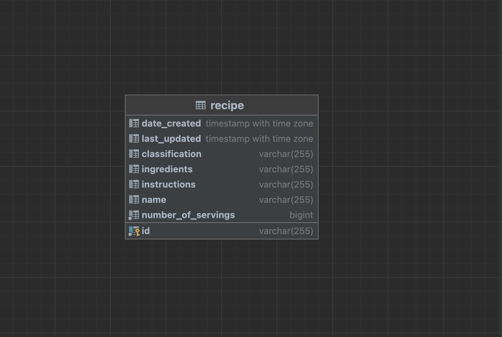
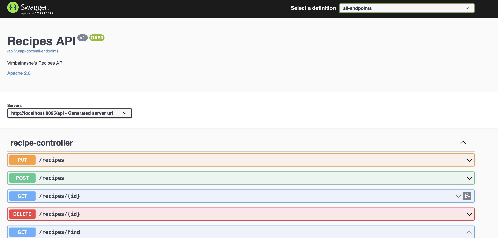

# ABN Amro Recipe Web Service Assignment

The recipe web service allows users to manage recipes. The service exposes REST APIs to add, update, remove, fetch and
filter recipes. The recipe REST API accepts and provides JSON for all endpoints.

### Architecture

The recipe web service was implemented based on the Model-View-Controller(MVC) architectural pattern. MVC separates an
application into three main logical components: model, view and controller were each component is built to handle a
specific aspect of an application depending on purpose. The business logic and presentation layer are isolated from each
other:

- Controller
    - Contains the REST APIs definition, it exposes the endpoints available for integration
- Service
    - It contains the logic and business rules to allow creating, removing, updating and fetching recipes.
- Repository
    - The repository layer maps the recipe entity object to the recipe database table

### Frameworks and Modules Used

| Feature                     | Framework/Module                                                                                                                              |
|-----------------------------|-----------------------------------------------------------------------------------------------------------------------------------------------|
| Recipe application          | [Springboot](https://spring.io/projects/spring-boot)                                                                                          |
| Recipe API documentation    | [Spring Doc](https://springdoc.org)                                                                                                           |
| Bean mappings               | [Mapstruct](https://mapstruct.org)                                                                                                            |
| Object Relationship Mapping | [Spring Data JPA](https://spring.io/projects/spring-data-jpa)                                                                                 |
| Exception Handling          | [ResponseStatusException](https://docs.spring.io/spring-framework/docs/current/javadoc-api/org/springframework/web/server/ResponseStatusException.html) |
| Logging                     | [SLF4J](http://www.slf4j.org/manual.html)                                                                                                     |
| Unit Tests                  | [Springboot starter test bundle](https://docs.spring.io/spring-boot/docs/1.5.7.RELEASE/reference/html/boot-features-testing.html)                                                                              |

### Prerequisites

* [JDK 11](https://www.azul.com/downloads/?version=java-11-lts)
* [Apache Maven](https://maven.apache.org/)
* [Postgres](https://www.postgresql.org)

### Steps to build and run recipe web service

The default profile creates an embedded in-memory database. However, the `dev` profile uses a Postgres database. In order to persist records into this database, it should be created with properties specified in the [application-dev.yml](src/main/resources/application-dev.yml) property file. The `recipe` table will be created automatically when the application is run. The database only has one table, see  
```shell
create database recipes_db;
create user postgres with encrypted password 'postgres';
grant all privileges on database recipes_db to postgres;
```

In the project, navigate to the application's root package
```shell
cd  abn-recipe-app
```

Build and run application including tests
```shell
mvn clean install
```

Or build and run application without tests
```shell
mvn clean install -DskipTests
```

> Visit [http://localhost:8095/api/swagger-ui/index.html](http://localhost:8095/api/swagger-ui/index.html) to review the recipe API documentation. It also has sample requests and responses for each endpoint.
If it loads successfully, the page should display as below:


